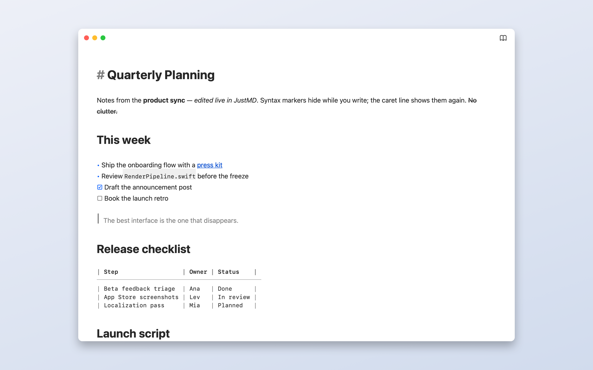

# JustMD

A free, open-source Markdown editor for macOS. Open a `.md` file and focus on the text: Markdown markers hide on every line except the one you're editing. Links show their text, lists get real bullets, and horizontal rules become hairlines.

Switch to **Read mode** (⇧⌘E) for rendered tables, checkboxes, and local images. Print the rendered document or save it as a PDF. Your documents stay in ordinary files on your Mac; there is no account, document upload, or sync service.

**[Download on the Mac App Store](https://apps.apple.com/app/id6779422717)** · [Website](https://justmd.nuta.life/) · [Report an issue](https://github.com/yuraist/just-md/issues)



## Features

- Native document windows with autosave, undo, and macOS file versions.
- Markdown formatting shortcuts, clickable task lists, and code highlighting.
- Edit and Read modes, printing, and PDF export.
- Built-in themes and custom themes you can import and export.
- Local images in Read mode, with explicit folder access under the macOS sandbox.

**Release status:** version 1.0 is available on the App Store (verified September 12, 2026). The `master` branch contains work for 1.1, including an optional newsletter signup and a “Buy me a coffee” in-app purchase for the App Store build. Those additions are not part of the published 1.0 release.

See [known issues](docs/known-issues.md) for current limitations, including remote images, large-document resizing, and table editing. Product scope and shortcuts are in [docs/product.md](docs/product.md).

## Requirements

- macOS 14 (Sonoma) or later
- Xcode 26.3+ with Swift 6.2.3 for development

## Build

```bash
open JustMD/JustMD.xcodeproj
```

For local development, select **Sign to Run Locally** in Signing & Capabilities for the app and test targets, then use ⌘R to run or ⌘U to test. You do not need the maintainer's Apple Developer account or App Store Connect credentials.

Or build and test from the repository root with local ad-hoc signing:

```bash
xcodebuild -project JustMD/JustMD.xcodeproj -scheme JustMD \
  -destination 'platform=macOS' -derivedDataPath build/DerivedData \
  DEVELOPMENT_TEAM= CODE_SIGN_IDENTITY=- build

xcodebuild -project JustMD/JustMD.xcodeproj -scheme JustMD \
  -destination 'platform=macOS' -derivedDataPath build/DerivedData \
  -parallel-testing-enabled NO -only-testing:JustMDTests \
  DEVELOPMENT_TEAM= CODE_SIGN_IDENTITY=- test
```

The app is built at `build/DerivedData/Build/Products/Debug/JustMD.app`. Swift Package Manager resolves the dependencies pinned in `Package.resolved`. The shared Debug scheme uses a local StoreKit configuration for test purchases. The optional newsletter form connects to the project's live subscription service; unit tests use stubs and do not subscribe real addresses.

## Continuous integration

The maintainer's release pipeline uses Xcode Cloud to test and archive pushes to `master` and `release/*`. The release Actions attach builds to App Store versions; a `vX.Y` tag initiates review submission. They require private App Store Connect credentials and are not needed to build a fork. See [distribution documentation](docs/distribution.md) for maintainer setup and release commands.

## Architecture

AppKit document-based app (`NSDocument` per file) with SwiftUI for the Welcome and Preferences windows.

| Module | Role |
|---|---|
| `App/` | `@main` AppDelegate; menu wiring (Format, View → Reading Mode + Theme, Show Welcome). |
| `Document/` | `MarkdownDocument: NSDocument`, window controller (Read/Edit toolbar), view controller. Autosave + versions via `NSDocument`. |
| `Editor/` | `NSTextStorage` subclass with incremental highlighting (`BlockDiff` restyles only the edited window). `MarkerVisibilityController` hides syntax glyphs off the active paragraph. `MarkdownLayoutManager` draws HR rules and quote bars. `swift-cmark` for GFM parsing, `Highlightr` (cached, async) for fenced-code tokens. |
| `Reader/` | `MarkdownReadRenderer` — AST → display attributed string: real `NSTextTable` grids, checkboxes, inline images. |
| `Theme/` | `Theme` / `Palette` Codable models; builtin + user presets; `.justmd-theme` JSON export/import. |
| `Welcome/` | SwiftUI Welcome window: New / Open / Drop / Recent. |
| `Preferences/` | SwiftUI Preferences + Manage Themes (colorpickers). Persistence via `UserDefaults`. |
| `Support/` | "Support JustMD" window (Help menu, Welcome link): newsletter signup posted to Supabase, and a repeatable "Buy me a coffee" StoreKit 2 consumable. The purchase code is compiled out with `DIRECT_DISTRIBUTION` (set by `scripts/release-devid.sh`), so the DMG build ships only the newsletter form. |

Product scope and shortcuts: [`docs/product.md`](docs/product.md).

## Dependencies (SPM)

- [`swift-cmark`](https://github.com/swiftlang/swift-cmark) — CommonMark + GFM parsing.
- [`Highlightr`](https://github.com/raspu/Highlightr) — syntax highlighting for code blocks.

Third-party license texts are included in [THIRD_PARTY_NOTICES.txt](JustMD/JustMD/Resources/THIRD_PARTY_NOTICES.txt) and bundled with the app. The separate [marketing tools](marketing/README.md) use Remotion to compose promotional videos; Remotion is not an app dependency and is not included in JustMD.

## Tests

Behavior tests use Swift Testing (`@Test`, `@Suite`, `#expect`) in the existing `JustMDTests` target.

Run: `xcodebuild ... -parallel-testing-enabled NO -only-testing:JustMDTests test` (parallel test hosts deadlock xcodebuild for an app-hosted bundle).

## Contributing

Bug reports and focused pull requests are welcome. Include reproduction steps and your macOS version when reporting a bug. Keep changes within the native document editor's scope, and add behavior coverage to the existing Swift Testing target. Run the tests above before opening a pull request. See [AGENTS.md](AGENTS.md) for repository guidance.

## License

JustMD's original code and documentation are available under the [MIT License](LICENSE). Third-party components retain their own licenses, listed in the [notices](JustMD/JustMD/Resources/THIRD_PARTY_NOTICES.txt). The official App Store app is free; building and distributing your own copy is also permitted by the license.
